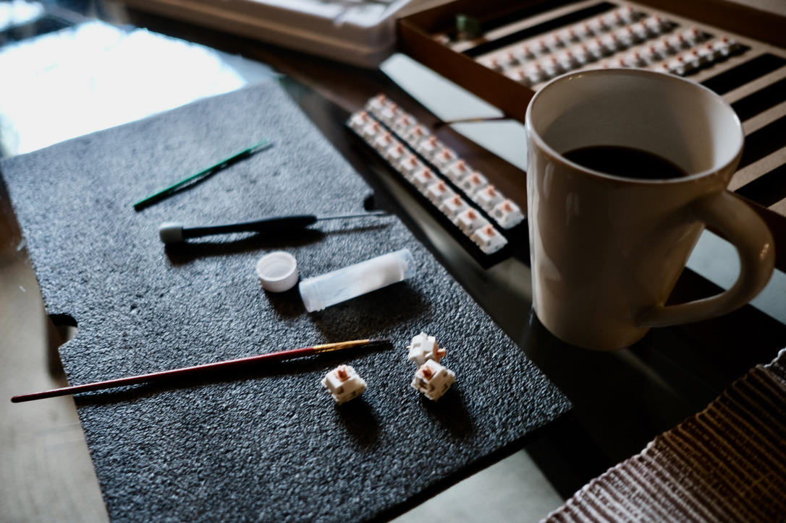

We live in a world where the rise of mobile technology means that almost everyone uses the same phone and watch and scrolls through the same apps. Consequently, we've seen the growth in popularity of tactile, non-digital experiences and products: pen and paper, film photography, and mechanical watches.

The custom mechanical keyboard community is very much in the same vein. The community obsesses over the visual, tactile, and acoustic typing experience: the feel of the mechanical switches, the case's weight, and the sound and color of the keycaps.

I first became interested in mechanical keyboards in 2014 when I purchased a full-length Das Keyboard with Cherry MX Brown switches. At the time, I wanted to move toward something quieter and picked up a Leopold FC660C, which I have been using up till recently. This year, after being exposed to the custom keyboard Reddit community through a coworker and Twitch streamers like [TaehaTypes](https://www.youtube.com/user/FeelgHoodMusic), I decided to build my own custom keyboard. 

<figure>
  
  <figcaption>NK65 and Leopold</figcaption>
</figure>

## Gathering parts

Building a keyboard allows you to custom every part of the typing experience. Keyboard components vary slightly, but in general, here's what you'll need:
    - A case
    - Keyboard switches
    - A circuit board (also called a PCB)
    - Stabilizers
    - Keycaps

There are many sizes, options, and variations available. The community's popular vendors are typically small companies ran by other enthusiasts, meaning that components sell out quickly. Gathering the specific items you want can be a challenge. When a particular piece is sold out, parts can be purchased on [r/mechmarket](https://www.reddit.com/r/mechmarket/), often at premium prices. 

I decided to build a 65% keyboard layout with the NovelKeys NK65, which I purchased for a good deal on [r/mechmarket](https://www.reddit.com/r/mechmarket/). It comes with a hot-swap PCB (no need for soldering) and an internal aluminum plate. For switches, I choose the very popular and hyped [Drop Holy Pandas](https://drop.com/buy/drop-invyr-holy-panda-mechanical-switches).

<figure>
  
  <figcaption>Adding Krytox 204G0 to all 70 switches</figcaption>
</figure>

## Lubing

Mechanical switches come in three types: tactile, linear, and clicky. A popular trend in the mech community is to apply lubricant to the internals of switches, improving acoustics and typing smoothness. Lubing is a tedious process involving opening every switch and applying the lube by hand.

Lubing my Holy Pandas took most of a Saturday afternoon. This [video](https://www.youtube.com/watch?v=5y5KoRFWXe8) provides a lubing tutorial if you are interested.

<figure>
  
  <figcaption>Popped all the switches into the hot-swap PCB, added keycaps, tested the PCB in Via, applied lube to stablizers</figcaption>
</figure>

## Assembly

My favorite part of the build process is selecting the keycaps. Keycaps come in different plastics and formats. I purchased two keycap sets for my NK65: GMK 9009 and GMK Olivia++. Once my keycaps arrived in the mail, I was ready to build my board.

I started by taking apart the case to remove the hot-swappable PCB. Then I inserted each switch into the PCB. Typically you would need to solder the switches to the circuit board, but in this case, the switches popped into the PCB when inserted correctly.

I connected the PCB to my computer to test the mapping of each key was working correctly using [Via](https://caniusevia.com/). Finally, I put the case back together and installed my keycaps.

I have loved the process of building this board. I have loved using it even more. It's a joy to sit down at my desk to code or to write. Please see the video below for a comparison between my Leopold FC660C and NK65. 

https://www.youtube.com/watch?v=6xU23MBSryU
<figcaption>NK65 vs Leopold FC660C. You can hear the differences between the Holy Panda and Topre switches.</figcaption>