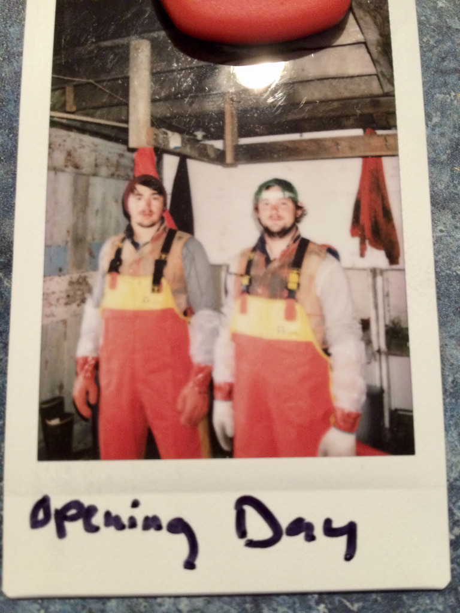
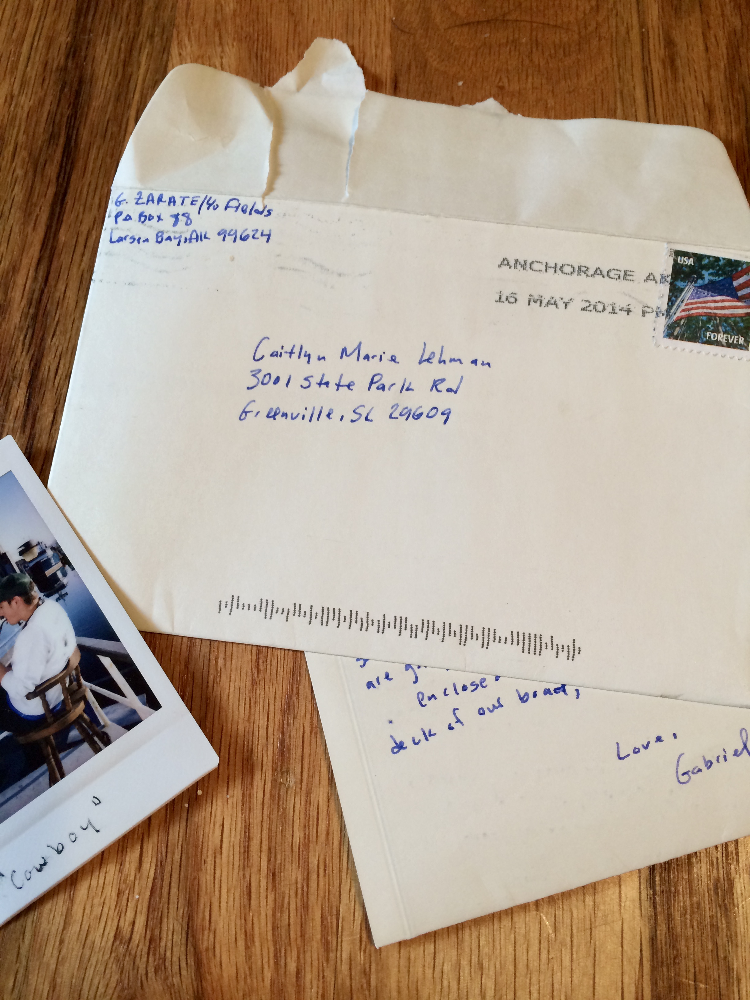

_The following are selections from the 80 letters I wrote to Caitlyn in the summer of 2014 while working for a commercial salmon fishing company in Kodiak, Alaska._

### 14 May 2014 - Kodiak Harbor

I am trying to think about things to share that I haven't already on the phone. Here in the harbor there is probably about a hundred large commercial fishing boats docked. Just about every evening we have seen sea lions come swim amongst the boats! They will surface from time to time. They are big and really fun to watch.

One frustrating experience has been when we are doing construction work like today. James and I have been helping another guy named Jeff. It's frustrating because both of them have experience with construction work and I don't. Sometimes I'll show my inexperience with some things and somehow its a big joke to them. It doesn't bother me too much but being the bottom guy on the totem pole can be frustrating after a long day. I think its just gives me incentive to learn the fishing stuff quickly.

<figure>
  
  <figcaption>Kodiak Harbor, Kodiak AK</figcaption>
</figure>

### 26 May 2014 - Arriving on the Island

We arrived on Bear Island for the first time today. We took a flight from Kodiak to Larsen Bay then took a ride in the skiff to Bear Island. The scenery is beautiful but our island itself isn't much to look at. We got here and almost immediately started mending nets. A guy named Peter showed me how to tie the knots to med the nets and I think I'm getting the hang of it. Also it turns out that our cook is really good -- this had been great news. James and I were able to get a room together just the two of us which is nice.

<figure>
  
  <figcaption>Bear Island</figcaption>
</figure>

### 28 May 2014 - Hiking

Because the season doesn't begin till the 9th, we are not able to send out mail everyday like we will be able to. Today was my second full day on the island. I am enjoying it. The work is pretty tedious. I mend nets most of the day. The nice thing is I get a break after lunch and I have been reading and napping. Maybe this summer I can learn to nap so I can enjoy many long naps next to you. I think a big part of passing the time and not going crazy will be the friendships. There is this guy name Luke who has been fun to get to know. Tonight after dinner me, James, Luke, and a guy named Micah hiked up to the highest point on the island. Its not that far but its still a good view up there. Luke said we were going to sprint to the top but we only got 3/4 of the way before we almost passed out breathless.

### 31 May 2014 - The Bana

The last two days have been tough has far as work goes. The weather has been pretty bad, a gale came in yesterday (when the wind blows really hard) and it was cold and rainy. But even though it hasn't been the best working conditions we've kept our spirits up.

Last night was my first shower here. But they don't just shower they use what they call a Bana. Basically, its a big sauna. We sit in there and sweat out all the nasty stuff then shower. It was super relaxing and I haven't felt so clean in my entire time here.

<figure>
  
  <figcaption>Opening Day</figcaption>
</figure>

### 6 June 2014 -- The Season Begins

Today is the second day of the season. Yesterday we got the nets out and our first pick was pretty big. We only picked the nets once and brought in around 8,000 lbs which is like $16,000. Not bad for the first day. When we put the nets out I didn't take any medicine for sea-sickness and we were out there in 36 mph winds with some pretty rocky seas. I threw up 3 different occasions several times and have those lovely broken blood vessel spots on my face. But after that I've been taking dramamine and I've been fine. Unfortunately, a few guts are still getting sick even though they are taking the medicine including James.

This morning I was picking with Calvin, a big 6' 5" guy with long curly blond hair that goes past his shoulders. He's super chill and also pretty goofy and a prankster. Anyway he was super fun. We were picking in one of the roughest nets and I was in the front trying to grab a rope over the side. A big wave came, taking the rope away from me and I didn't let go. I fell right over the side into the ocean and 2 seconds later Calvin was there pulling me out. Haha it was pretty fun and cold dip in the ocean.

<figure>
  
  <figcaption>Calvin</figcaption>
</figure>

The biggest praise is that I haven't continued to get sea sick. That was miserable the first time. Being out amongst the weather and rough seas has also reminded me a good bit of the boating accident, but not necessarily in a negative way. I think about it and thank God for using that experience to make me stronger and for allowing me to be back out there without fear. On the back of my orange rain jacket I wear out there I wrote in sharpie: "Joy follows suffering and life follows death" with Dad's and Earl's initials underneath. I see it as a proclamation to the ocean and the waves that even though that day on the Gulf was hard, God has made me stronger and Christ has brought me joy. Joy that comes from being in a love relationship with the King of the Universe who calmed the seas and gives me hop that I will see both my Dad's again.

### 10 June 2014

We had a longer break today because of the weather so its been nice to get some extra rest. My back and my hands are very sore so much so that I have to take breaks as I write this letter. They say that the soreness goes away after a few more weeks.

### 11 June 2014 -- Heads or Tails

Yesterday I was picking with Luke when we caught a herring in the net (a herring is a small salmon like a little longer than my hand). He picked it up and said, 'Heads or tails, Gabe?' I didn't really understand what he meant but replied, "tails." He then bit off the head, spit it out, and handed me the rest! So I bit off the tail. Nasty stufff! They said the tail is worse because its where...well I'll let you imagine what comes out near the tail.

<figure>
  
  <figcaption>Letters</figcaption>
</figure>

### 12 June 2014

How long is it taking to get to Greenville? If the weather is good your letters have been getting here in five to six days which is really nice.

### 14 June 2014

Theres not much new to tell here. We've done well as far as the amount of fish we've caught. I think we are close to me the 100,000 lbs mark.

Can you mend me an update on the World Cup? You can probably print out what the scores have been and who scored during the games. That would be awesome.

### 17 June 2014

It's been storming here for the past few days so we haven't been able to pick the nets 3 times a day. In some ways it feels like we've been fishing for a long time already but in the scheme of things we are just getting started. It can be too overwhelming to dwell on how much time I still have to be on this island. I prefer to take the days one at a time and pray a lot.

You asked about who I am close to up here. I get along decently well with everyone. Luke I love a lot, he is from Charleston actually. He's kind of a loner and has done things like hike the Appalachian Trail by himself. In the off season he lives in Hawaii and surfs everyday. Calvin is also another guy I like. I can't really say I am close to anyone yet though.

So I gave it my best shot but I'm out of practice and my hand is sore so I'm going to switch back. I miss you so much. I was so glad to receive your letters today. I love you Caitlyn. Theres a guy here name Mike who as a pretty pessimistic view of marriage (He has an ex-girlfriend and a couple of kids he never gets to see). He has made a few jokes about me getting married to the first girl I started dating, saying that I don't know if there is something else out there better. My response is that I know plenty of girls and they all represent confirmation after confirmation that what I have is far better. I mean that with all my heart. You are amazing, Caitlyn. I am so blown away by your Christ-like love for me and for others. In many ways I feel like you are a better person than I am and that you make me better.

### 21 June 2014 -- Summer Solistice

Well today is the summer solstice and they say that the sun won't set until 1am.

The closure was two days long and was a nice break from fishing. The sun has been out for the last two days as well. We haven't seen sunshine very much.

I want to hear about you. How did the wedding dress shopping go? What are you hopes and dreams and desires? :)

<figure>
  
  <figcaption>The Crew (left to right): Luke, Josh, Evan, Adam, Calvin, James, Micah, Gabriel, Casey, Mike, Moreno, Mark</figcaption>
</figure>

### 24 June 2014 - The Crew

There are 12 crewmen total. Mike is from Louisiana and bas been coming up to work for the Fields for the last 7 years! He is given a lot of responsibility over the crew and is a really nice guy. Adam, Casey, and Mark are all from Florida. Adam is a big guy whit lots of tattoos and is kind of a big, fat southern teddy bear. Casey annoys me the most probably. He likes to talk a lot and try to tell me what to do when he doesn't really know what he's doing himself. Mark is interesting. He has done some pretty hard drugs and tells some wild stories. Micah and Evan are the young guys from Idaho. They are both eighteen and are farm boys. Peter is from California but lives in Tennessee. He's a climber and we have some really good conversations. He wants to go to seminary and really seems to love people. Luke, I like a lot. He's a surfer from Charleston and is a pretty relaxed but funny guy. Then theres Calvin who is the long, curly haired giant who has the most infectious smile. He's a goof ball. Josh is also from California and is also annoying.

Kelsey is the cook. She makes really good food and has a no nonsense attitude that is good for a girl in her position. Overall is a really good group. We laugh a lot.

So you found the dress. I'm so excited and I could feel your excitement even through the letter so I know it must be the right one. God is so good to have brought the right one at the right time. I'm so curious about it now!

The sun has been shining here for the past few days. Its been so great to have better weather. I got stung by some jellyfish this afternoon which was annoying. Its really no big deal just an annoying stinging sensation. My facial hair gets more hideous day by day so thats good. :)

### 26 June 2014

I keep coming back to the concept of contentment. Sometimes I being trying to count the days and I can get kind of discouraged. Actually, not kind of discouraged, really discouraged. Though I think I can have a healthy sense of longing for home and you, I think God wants me to find satisfaction and contentment in __today__. He has given me so much. He is good and I can't wait to enjoy the blessings he has in store for me when I return.

### 27 June 2014

I think the biggest prayer request would be endurance to keep going. Its long hours and long days here and theres a long way to go. Some mornings its tough to get up and get going without being discouraged. This is often where my prayer time comes in because I being to thank God for what he as given me. But once I get going for the day things get better.

### 3 July 2014

After every morning pick there is normally a couple of hours for shore work before lunch (depending on how long the pick takes). The last two days I've been working in the Wash Skiff. In the Wash Skiff there is a really powerful pressure washer we use to wash kelp and algae our of the nets. The unpleasant part is that all the kelp, algae, and jellyfish end up spraying up into the air all over me. I'm normally covered with the stuff by the end. At least I can just hop in the shower when I get back to shore...oh wait, no I can't :). Washing is a job a lot of the guys like to complain about. Even though its not my favorite, I force myself not to complain.

### 4 July 2014

All the days seem to run together here. We've been catching a pretty steady 5 to 7 thousand pounds a day. That much everyday really builds up over a period of weeks. We're getting closer to the $300,000 mark when I'll begin making money above my guarantee.

James and I have continued to get to know Calvin (Luke has been fishing up in Bristol Bay for the last several weeks but he'll be back mid-July). We've been doing push-ups everyday after the evening pick. We do so much pulling out of the water that the push-ups seem to help relieve some muscle tension.

### 7 July 2014 -- Dog Shark

No much new here. I caught a Dog Shark in the net yesterday. Its eyes were creepy and it was still alive. I was able to set it free.

<figure>
  
  <figcaption>Mending during closures</figcaption>
</figure>

### 9 July 2014 -- Closures

Our closure was scheduled to begin tomorrow but there is a storm predicted for tomorrow so the plan is to get the nets out of the water today. I'm looking forward to have a little break from fishing for a few days. During closures we spend a lot of time mending nets, cleaning nets, and reloading them into skiffs. But it also means I won't be able to send / receive mail for a few days. But I get to talk to you in four days!!

### 14 July 2014 -- Killer Whales

It was so good to talk to you yesterday. I loved being able to hear your voice and how you are doing. I was also encouraged to hear that time is passing quickly for you. During the call, I didn't have as much privacy as I wanted because my boss was in and out of the room. He also told me to get off the phone at the end of our call. I was so glad to talk to you but it was also hard...that call hasn't helped me miss you any less. My thoughts are the call were "I was I was home.

So I was a little discouraged after that but then something incredible happened! On the evening pick, I was fishing just off of Harvester when a group of about 10 killer whales came by! We drove the skiff out to get closer. They were huge and so cool! At one point, one of the dove down, swam right under the skiff, then resurfaced on the other side. I was so close I got sprayed by the mist come out of its blow hole! There were about 8 larger ones and two small babies. It was such a fun and unexpected experience, they don't come by very often. I prayed and thanked God for encouraging me with his awesome creation.

I've been reinvigorated to go out to fish now that I'm making money with every fish we catch. Keep praying that the fish keep coming. Our current opening is only for 4 days then we'll have another 2 day closure. Its pretty inconvenient!

<figure>
  
  <figcaption>Set Netters Picnic</figcaption>
</figure>

### 20 July 2014 -- Set Netters Picnic

Yesterday was the Set Netters Picnic. We got up and worked in the morning, loading and mending nets, then went to Harvester around 1pm and were off of work till 7pm. I haven't had that long of free time in a long while. At the picnic, I met several of the families / crews that fish around the bay. A lot of the families seemed much more normal than I was expecting. We ate grilled hamburgers and hot dogs (I've missed grilled food so much) and drank plenty of soda. We mad a fire on the beach and relaxed and James and I beat these other two guys in a game of two-on-two basketball. It was really nice to not have to think about work for a little while. We also took a short hike out to these cliffs where get got close to an eagles' nest. There were two little eaglets sleeping inside.

I definitely agree with what you wrote about perspective. I could so easily focus on the things that frustrate me (the hard work, the crazy people who run this business, the distance from you, the out house) but I choose to focus on the good and the daily blessings. It's not even because I'm a good person or anything. Its just that for me its the only way to survive with my sanity.

### 22 July 2014

Wow the Save the Dates came out so well! You did such a great job with them theres really nothing I would change. I've been looking at it for a while now and it just hit me. "This is for __my__ wedding!" I really don't think they could've come out any better. Several of the guys here said "that looks like its from a magazine." They all tell me how they are going to come and crash my wedding.

### 28 July 2014 -- Campfire on the Beach
    
It was so good to receive your letters last night. We are in another closure right now so I haven't been able to send / receive mail but the Fields had to make an unexpected trip to Larsen Bay. Last night we were able to finish mending the nets early and had a fire on the beach and cooked dinner out there. I sat out there probably till 1am. Its starting to get a little darker here at night and the stars are beginning to show. I hear at the end of the season the stars are beautiful.

### 3 August 2014

We put the nets back into the water this morning. This opening is only for the next 3 days unless we get an extension. The closures give me mixed feelings. They are annoying because we aren't making money those days and I can't send / receive mail, but they are also a nice break from the hard days of fishing. I've made about $12,000 so far so thats pretty cool.

Luke is staying at least till September so thats nice. Now that it is August I'm pretty encouraged about the time left. Its still a while be we can do this. My birthday is exactly one month away (we get to talk on the phone that day) and then my contract ends one month later! I'm pretty burnt out from all the fishing but I'm trying to pretend this is my first month of fishing instead of my third.

### 5 August 2014

James leaves one month from today. I'll miss having him here but I know by the time he leaves I'll have less than a month left!

We're scheduled to have another closure after tomorrow unless we get an extension. I've been working on writing letters to the guys to ask them to be my groomsmen this week. I have about half of them sent out. I think it will be cool to hear back from some of them though I don't necessarily expect to.

### 11 August 2014

Last night we went out to pick the fish at 7pm and didn't get back till midnight when it was totally dark. We picked about 25,000 lbs of fish in those 5 hours in rough weather. This morning I picked this one net called "the Third" and something incredible happened. We caught a dog shark, a skate (which is a huge arrow-shaped stingray), an octopus, and a porpoise (baby dolphin) in one net! It was crazy. I pickup up the octopus and placed it on my chest. It was sticking to me and slowly moving down my leg. No one ever catches that many crazy things in one net.

### 15 August 2014

There is a note about our door that says "use your core" We do a lot of pulling lines against strong tides out on the ocean so its a reminder to use your core to pull rather than destroying our back all the time.

### 23 August 2014 -- Cliff Jumping

Yesterday during our break Luke, James, Moreno, and I hiked to the back side of the Island and jumped off this high cliff into the water. We got it on video and it was super fun. I often just want to rest during break but I'm always glad when I do something out of the ordinary -- I think those Weill be the times I really remember.

### 24 August 2014

I think this summer one thing I've learned to do is to enjoy the little things. Like enjoying the moments of free time, the sunset, smoking my pipe, a banana (yesterday I had my first banana in four months!), a love song (that reminds me of you). I guess what I am trying to say is that I can't wait to enjoy these little things when we live together and your my constant companion. Little things like looking into each others eyes, like me tickling you one minute then us making love the next, like going to buy groceries together and making meals together. Like taking Sunday afternoon drives to who knows where. Like camping and hiking together. Like kissing each other goodnight but still being together.

### 26 August 2014 -- Birthday letters

Soo I received 55 letters in the mail this morning. Haha that was incredible. I have a strong feeling that your father was behind it all. I laughed so much and they were really encouraging to ready. They make me miss home a lot.

### 31 August 2014

The sun is shining here and the last few days have been pretty calm without storms. We're catching a pretty consistent 8,000 lbs per day and will probably fish for at least another 8 to 10 days. Then we'll begin packing everything as well as preparing some things for next season. The first thing we'll do after taking up the nets is taking up all the anchors out there. Theres a lot. We're losing like 7 minutes of daylight per day so our work days will get a little shorter.

### 6 September 2014

The fishing has been really good here for the past few days. There will probably be some storms coming next week but for now things are good. We're basically going to keep fishing until the Cannery decides to close and stops buying our fish. That could be any day if the fishing goes bad but for now the fish keep coming.
   
## 10 September 2014 -- The Fire

So last night was crazy. I was having trouble falling asleep and didn't drift off till after 1am. Around 2am, Luke comes bursting into my room and says "Gabe, wake up theres a fire!" He runs out of the room and at first I thought he was playing some sick joke by waking me up in the middle of the night. Then I looked out the window. The generator house (a small building where we get electricity from diesel powered generators) was in flames.

So Luke and I run out of the Hilton towards Westin's house to wake him up. Eventually we woke up the whole crew and everyone was racing around grabbing fire extinguishers and hooking up the fire hose. It was dangerous because theres a 500 gallon tank full of diesel connected to the building and the flames were all over it. I thought it was going to explode any second. After a while we got the flames away from the tank and put the fire out after about two hours. The building was totally destroyed. I didn't fall back asleep till like almost 5am so I've been pretty exhausted today. Its definitely a blessing that no one was hurt and that we woke up before it spread to other buildings. Whew just another exciting night on Bear Island. :)

### 12 September 2014

At the most, we have four more days of fishing. I'm really ready to stop fishing and begin the long process o putting everything away. A storm came in yesterday and its still pretty rough out there. Thankfully last night it was getting dark earlier and light later. It doesn't get light till like 8:30am in the morning and dark around 9 at nights. So that gives me some more time to sleep.

My contract ends 3 weeks from today! I'm really excite even thought it feels a ways off because of everything we have left to get done.

### 20 September 2014

We are finished fishing. The nets are out of the water. We have been bagging the nets and washing and we'll start taking up the anchors soon. Since we've been done fishing I haven't been able to send / receive mail for a few days now. We're probably going to make a trip into Larsen Bay in the next day or two so I'm writing this letter now.

My ticket has been purchased! I was so excited when the Fields told me. I don't have all the flight info yet though but I do know that Duncan was able to buy my ticket for $300 less than James! That was great news. If everything goes according to plan, I'll be flying into Kodiak on the 4th. So you should hear from me then. I guess you'll be in Florida, right?

I'm still very tired but I'm finding that I'm having trouble falling asleep because I keep thinking about being back. Thinking about it doesn't make time go by very quickly so pray for me these two final weeks.
 
How long should I kiss you in the airport? Probably no less than 10 minutes, right? :)

<figure>
  
  <figcaption>Reunited</figcaption>
</figure>

