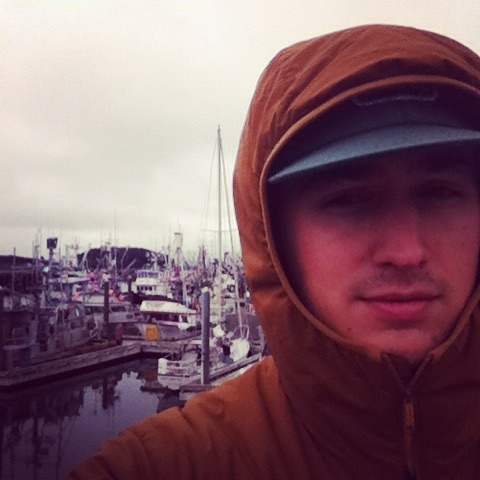

_The following are selections from the 80 letters I wrote to Caitlyn in the summer of 2014 while working for a commercial salmon fishing company in Kodiak, Alaska._

### 14 May 2014 - Kodiak Harbor

I am trying to think about things to share that I haven't already on the phone. Here in the harbor there is probably about a hundred large commercial fishing boats docked. Just about every evening we have seen sea lions come swim amongst the boats! They will surface from time to time. They are big and really fun to watch.

One frustrating experience has been when we are doing construction work like today. James and I have been helping another guy named Jeff. It's frustrating because both of them have experience with construction work and I don't. Sometimes I'll show my inexperience with some things and somehow its a big joke to them. It doesn't bother me too much but being the bottom guy on the totem pole can be frustrating after a long day. I think its just gives me incentive to learn the fishing stuff quickly.

Lorem ipsum dolor sit amet, consectetur adipiscing elit. Nam aliquet rhoncus felis, in scelerisque diam. Fusce in eros lacinia, dictum nunc in, auctor elit. Vivamus blandit felis sed quam dictum, nec aliquet mi dictum. Orci varius natoque penatibus et magnis dis parturient montes, nascetur ridiculus mus. Nam facilisis arcu sed arcu sodales finibus. Aliquam ut nisl in magna dignissim suscipit eget ut lorem. Duis eu ex mauris. Mauris nec quam lacinia, euismod eros eget, facilisis magna.

Donec velit est, vehicula scelerisque leo sit amet, imperdiet tempus risus. Quisque nec velit nisl. Etiam sed eros leo. Proin at viverra lorem. Praesent posuere, neque eu tristique dapibus, lorem eros accumsan elit, ut interdum purus tortor vel lorem. Suspendisse accumsan, massa at porttitor molestie, felis mi efficitur ante, a sagittis eros ex auctor orci. Etiam eu consectetur arcu, nec hendrerit eros. Suspendisse potenti. Donec vitae diam ut augue lacinia vehicula sed sed arcu. Proin quis ligula a magna rutrum maximus. Aenean sit amet neque elit.

## Writing Letters

Proin ac lacus venenatis, consectetur enim in, ultricies odio. Vestibulum pellentesque sem sed dolor ornare congue. Aliquam vestibulum risus vel lacinia volutpat. Duis nibh orci, finibus ac tempus et, varius at lectus. Morbi justo magna, aliquam porttitor leo quis, malesuada imperdiet ante. Mauris non justo quam. Suspendisse euismod posuere nisi eget aliquam. Cras malesuada arcu ipsum, in consequat risus hendrerit sit amet. Curabitur eget elementum nisi. Phasellus ut tortor ante. Donec dapibus quam non ultrices elementum. Aenean posuere tortor purus. Ut eleifend interdum neque, in iaculis velit laoreet a. Pellentesque porttitor ipsum tincidunt ex finibus, a auctor leo facilisis. Sed non leo ut justo ornare rhoncus eu id odio. Cras eget quam ac felis faucibus porta.

<figure>
  
  <figcaption>Kodiak Harbor, Kodiak AK</figcaption>
</figure>

## To Disconnect

Suspendisse commodo nisl non accumsan porttitor. Sed in lacinia magna, vitae finibus lacus. Aliquam pharetra tincidunt velit eu suscipit. Donec malesuada mauris sed massa mollis aliquam. Praesent aliquet venenatis blandit. Aliquam erat volutpat. Donec et est blandit, dignissim sapien et, volutpat eros. Sed feugiat lobortis sem. Sed eu orci eu velit efficitur consequat eget quis purus. Sed gravida augue nec pulvinar hendrerit. Nunc id rhoncus lacus. Morbi mollis sodales mauris quis viverra. Morbi eleifend nec massa ut tristique. In maximus odio at congue fringilla. Aliquam eu orci quam. Vestibulum ante ipsum primis in faucibus orci luctus et ultrices posuere cubilia curae;

Aenean id mollis nibh, ut posuere mauris. Aliquam pulvinar commodo feugiat. Suspendisse potenti. Nunc rutrum nisl enim, ut cursus tortor sollicitudin in. Nam a metus eget magna bibendum interdum. Vestibulum ante ipsum primis in faucibus orci luctus et ultrices posuere cubilia curae; Curabitur hendrerit leo risus. Aenean ut tellus vel erat hendrerit sollicitudin ac eget urna. In aliquet at massa vel sodales. Vestibulum vel lacus auctor, dignissim justo eget, gravida neque. Vivamus sagittis ex 

