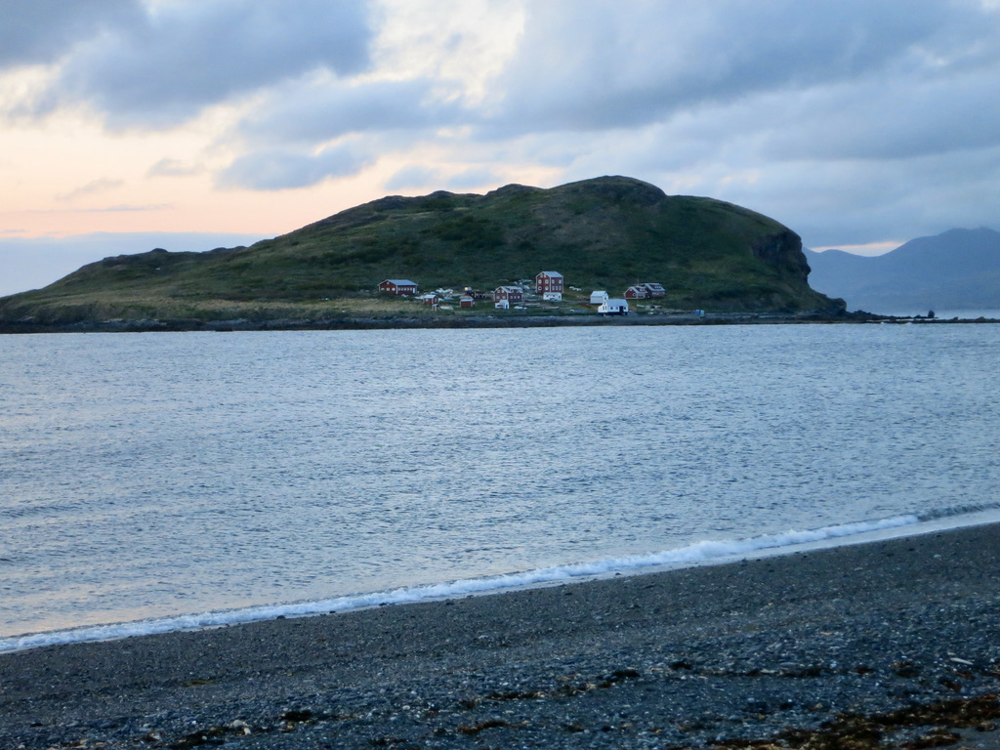
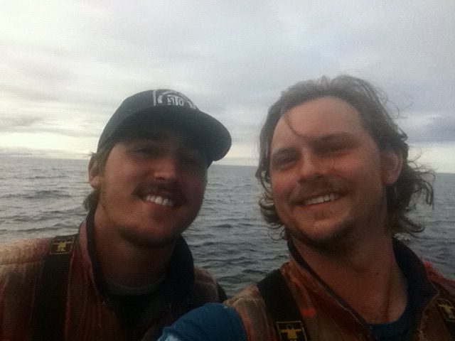

_The following are selections from the letters I wrote to my fiancé in the summer of 2014 while working for a commercial salmon fishing company in Kodiak, Alaska._

### 14 May 2014 - Kodiak Harbor

Here in the harbor, there are probably about a hundred large commercial fishing boats docked. Just about every evening, we have seen sea lions come swim amongst the boats! They will surface from time to time. They're huge and entertaining to watch.

I was a little frustrated while we were working today. James and I have been helping another guy named Jeff. I'm frustrated because both of them have more experience with construction work. Sometimes I'll show my inexperience, and become the joke on the job site. It doesn't bother me too much, but being on the bottom of the totem pole isn't where I like to be. It just gives me the incentive to learn the fishing knots quickly.

<figure>
  
  <figcaption>Kodiak Harbor, Kodiak AK</figcaption>
</figure>

### 26 May 2014 - Arriving on the Island

We arrived on Bear Island today. We took a flight from Kodiak to Larsen Bay, then hopped in the skiff to Bear. The scenery is beautiful, but our Island itself isn't much to look at. We got here and immediately started mending nets. A guy named Peter showed me how to tie the knots to mend the nets, and I'm getting the hang of it. Also, it turns out that our cook is great &mdash; what fantastic news! James and I were able to get a room together, just the two of us, which is nice.

<figure>
  
  <figcaption>Bear Island</figcaption>
</figure>

### 28 May 2014 - Hiking

Because the season doesn't begin till the 9th, we can't send out mail every day like we will be able to. Today was my second full day on the Island. I mend nets most of the day. The nice thing is I get a break after lunch, and I have been reading and napping. Maybe this summer I can learn to sleep so I can enjoy many long naps next to you. 

I think a big part of passing the time and not going crazy will be the friendships. Tonight after dinner James, Luke, Micah, and I hiked up to the highest point on the Island. It's not that far, but there is a good view up there. Luke challenged us to sprint to the top, but we only got 3/4 of the way before we almost passed out breathless.

### 31 May 2014 - The Bana

The last two days have been challenging as far as work goes. The weather has been pretty bad, a gale came in yesterday (when the wind blows hard), and it was cold and rainy. But even though it hasn't been the best working conditions, we've kept our spirits up.

Last night was my first shower here. But they don't just shower; they use what they call a Bana. It's a giant sauna. We sit in there and sweat out all the nasty stuff, then rinse off. It is super relaxing, and I haven't felt so clean in my entire time here.

<figure>
  
  <figcaption>Mike Falcochio</figcaption>
</figure>

### 6 June 2014 - The Season Begins

Today is the second day of the season. Yesterday we got the nets out, and our first pick was pretty big. We only picked the nets once and brought in around 8,000 lbs, equal to like $16,000. Not bad for the first day. 

When we put the nets out, I didn't take any medicine for sea-sickness, and we were out there in 36 mph winds with some pretty rocky seas. I threw up on three different occasions several times and now have those lovely broken blood vessel spots on my face. Now I've been taking Dramamine, and I've been fine. Unfortunately, a few guys are still getting sick even though they are taking medicine, including James.

This morning I was picking with Calvin, an oversized 6' 5" guy with long curly blond hair that goes past his shoulders. He's super chill, goofy, and a prankster. Anyway, we had a great time. We were picking in one of the roughest nets, and I was in the front reaching to grab a rope over the side. A big wave came, pulling the rope away from me, and I didn't let go. I fell right over the side into the ocean. In a flash, Calvin ran to the front of the skiff to pull me back in. Haha, what a fun, cold dip in the ocean.

Being out amongst the weather and rough seas has reminded me of a fair bit of the boating accident, but not necessarily in a negative way. I think about it and thank God for using that experience to make me stronger and for allowing me to be back out there without fear. On the back of my orange rain jacket I wrote in Sharpie: "Joy follows suffering and life follows death" with Dad's and Earl's initials underneath. It's a proclamation to the ocean and the waves that even though that day on the Gulf was hard, God has made me stronger and brought me joy. The joy that comes from being in a love relationship with the King of the Universe, who calmed the seas and gives me hope that I will see both my Dad's again.

<figure>
  
  <figcaption>Calvin Bulthuis</figcaption>
</figure>

### 10 June 2014

We had an extended break today because of the weather, so I've been getting extra rest. My back and hands are very sore, so much so that I have to take breaks as I write this letter. They say that the soreness goes away after a few more weeks.

### 11 June 2014 - Heads or Tails

Yesterday I was picking with Luke when we caught a herring in the net (a herring is a small salmon, a little longer than my hand). He picked it up and said, "Heads or tails, Gabe?" I didn't understand what he meant but replied, "tails." He bit off the head, spit it out, and handed me the rest! So I bit off the tail. Nasty stuff! Guys on the crew said the tail is worse because it's where...well, I'll let you imagine what comes out near the tail.

### 12 June 2014

How long is it taking my letters to arive in Greenville? If the weather is good, your letters have been getting here in five to six days, which is quicker than I expected.

<figure>
  
  <figcaption>A day on the job. Heavy on the sunshine, light on the fish.</figcaption>
</figure>

### 14 June 2014

There's not much new to tell here. We've done well as far as the amount of fish we've caught. I think we are close to me the 100,000 lbs mark.

Can you send me an update on the World Cup? You can probably print out what the scores have been and who scored during the games. That would be awesome.

### 17 June 2014

It's been storming here for the past few days, so we haven't been able to pick the nets three times a day. It seems like we've been fishing for a long time, but we are just getting started in reality. It can be too overwhelming to dwell on how much time I still have to be on this Island. I prefer to take the days one at a time.

You asked about who I am close to up here. I get along decently well with everyone. Luke is from Charleston. He's a loner and a wild one; he's hiked the Appalachian Trail by himself. In the off-season, he lives in Hawaii and surfs every day. Calvin is also another guy I like. I can't say I am close to anyone yet, though.

I was so glad to receive your letters today. I love you, Caitlyn. There's a guy named Mike who has a pretty pessimistic view of marriage. He has made a few jokes about getting married to the first girl I started dating, saying that I don't know if there is something else out there better. My response is that I know plenty of girls, and they all represent confirmation after confirmation that what I have is far better. xo :)

### 21 June 2014 - Summer Solistice

Today is the summer solstice, and they say that the sun won't set until 1 am. The closure was two days long and was a nice break from fishing. The sun has been out for the last two days as well. We haven't seen the sunshine very much.

I want to hear from you. How did the wedding dress shopping, go?

<figure>
  
  <figcaption>The Crew (left to right): Luke Yarborough, Josh Krohn, Evan Dundas, Adam Wilson, Calvin Bulthus, James Peery, Micah Glassman, Gabriel Zarate, Casey Furnish, Mike Falcochio, Moreno, Mark Barnes</figcaption>
</figure>

### 24 June 2014 - The Crew

There are 12 crewmen in total. Mike is from Louisiana and has been coming up to work for the Fields for the last seven years! He is given a lot of responsibility for the crew and is a nice guy. Adam, Casey, and Mark are all from Florida. Adam is a big guy with lots of tattoos and is a big, fat southern teddy bear. Casey annoys me the most probably. He likes to talk a lot and try to tell me what to do when he doesn't know what he's doing himself. Mark is interesting. He has done some pretty hard drugs and tells some wild stories. Micah and Evan are the young guys from Idaho. They are both eighteen and are farm boys. Peter is from California but lives in Tennessee. He's a climber, and we have some great conversations. He wants to go to seminary and seems to love people. Luke is a surfer from Charleston and is a relaxed but funny guy. Then there's Calvin, who is the long, curly-haired giant who has the most infectious smile. What a goofball. Josh is also from California and is not my favorite.

Kelsey is the cook. She makes delicious food and has a no-nonsense attitude that is good for a girl in her position. Overall it is a great group. We laugh a lot.

So you found the dress! I could feel your excitement even through the letter, so I know it must be the right one. I'm so curious about it now!

The sun has been shining here for the past few days. It's been so great to have better weather. I got stung by some jellyfish this afternoon. It's no big deal, just an irritating stinging sensation. 

<figure>
  
  <figcaption>Backside of Bear at sunset</figcaption>
</figure>

### 26 June 2014

I keep coming back to the concept of contentment. Sometimes I try to count the days, and I can get discouraged. Not just a little down, like really discouraged. I can't wait to return.

### 27 June 2014

I think the most significant prayer request would be endurance to keep going. It's long hours and long days here, and there's a long way to go. Some mornings it's tough to get up and get going. Once I get up and eat breakfast, things get better.

### 3 July 2014

After every morning pick, there is usually a couple of hours for shore work before lunch (depending on how long the pick takes). For the last two days, I've been working in the Wash Skiff. In the Wash Skiff, we use a powerful pressure washer to wash kelp and algae out of the nets. The unpleasant part is that all the kelp, algae, and jellyfish end up spraying up into the air all over me. I'm typically covered with the stuff by the end. At least I can hop in the shower when I get back to shore...oh wait, no, I can't :). A lot of guys like to complain about washing. Even though it's not my favorite, I try not to complain.

### 4 July 2014

All the days seem to run together here. We've been catching a pretty steady five to seven thousand pounds a day. That much every day builds up over weeks. We're getting closer to the $300,000 mark when I'll begin making money above my guarantee.

James and I have continued to get to know Calvin (Luke has been fishing up in Bristol Bay for several weeks, but he'll be back mid-July). We've been doing push-ups every day after the evening pick. We do so much pulling out of the water that the push-ups seem to help relieve some muscle tension.

### 7 July 2014 - Dog Shark

No much new here. I caught a Dog Shark in the net yesterday. Its eyes were creepy, and it was still alive. I was able to set it free.

<figure>
  
  <figcaption>Mending during closures</figcaption>
</figure>

### 9 July 2014 - Closures

Our closure was scheduled to begin tomorrow, but there is a storm predicted, so the plan is to get the nets out of the water today. I'm looking forward to having a little break from fishing for a few days. We spend a lot of time mending nets, cleaning nets, and reloading them into skiffs during closures. But it also means I won't be able to send/receive mail for a few days. But I get to talk to you on the phone in four days!!

### 14 July 2014 - Whales

It was so good to talk to you yesterday. I loved being able to hear your voice and how you are doing. I was also encouraged to hear that time is passing quickly for you. During the call, I didn't have the privacy I wanted because my boss was in the room. He also told me to get off the phone at the end of our call. I was so glad to talk to you, but it was hard...that call hasn't helped me miss you any less. My thoughts afterward were, "I wish I was home."

So I was discouraged after that, but then something incredible happened! On the evening pick, I was fishing just off of Harvester when a group of about ten killer whales came by! We drove the skiff out to get closer. They were huge and so cool! At one point, one of them dove down, swam right under the skiff, then resurfaced on the other side. I was so close I got sprayed by the mist coming out of its blowhole! There were about eight larger ones and two small babies. It was such a fun and unexpected experience; they don't come by very often.

I am reinvigorated to fish now that I'm making money with every fish we catch. Keep praying that the fish keep coming. Our current opening is only for four days; then, we'll have another 2-day closure. The constant closures are pretty inconvenient!

<figure>
  
  <figcaption>Set Netters Picnic</figcaption>
</figure>

### 20 July 2014 - Set Netters Picnic

Yesterday was the Set Netters Picnic. We worked in the morning, loading and mending nets, then went to Harvester around 1 pm and were off work till 7 pm. I haven't had that much free time in a long while. At the picnic, I met several of the families/crews that fish around the bay. Many of them seemed more normal than I was expecting. 

We ate grilled hamburgers and hot dogs (I've missed grilled food so much) and drank plenty of soda. We made a fire on the beach and relaxed, and James and I beat these other two guys in a game of two-on-two basketball. It was nice not to have to think about work for a little while. We also took a short hike out to these cliffs to get close to an eagles' nest. Two little eaglets were sleeping inside.

I agree with what you wrote about perspective. I could so easily focus on the things that frustrate me (the hard work, the crazy people who run this business, the distance from you, the outhouse), but I choose to focus on the good and the daily blessings. It's not even because I'm a good person or anything. It's just that for me, it's the only way to survive with my sanity.

### 22 July 2014

Wow, the Save the Dates came out so well! You did such a great job with them. There's nothing I would change. I've been looking at it for a while now, and it just hit me. "This is for __my__ wedding!" I don't think they could've come out any better. Several of the guys here said, "that looks like it's from a magazine." They all tell me how they are going to come and crash my wedding.

<figure>
  
  <figcaption>Campfire on the Beach</figcaption>
</figure>

### 28 July 2014 - Campfire on the Beach
    
It was so good to receive your letters last night. We are in another closure right now, so I haven't been able to send/receive mail, but the Fields had to make an unexpected trip to Larsen Bay. Last night, we finished mending the nets early and had a fire on the beach, and cooked dinner out there. I sat by the fire till 1 am. It's starting to get a little darker here at night, and the stars are beginning to show. I hear the stars are beautiful at the end of the season.

### 3 August 2014

We put the nets back into the water this morning. This opening is only for the next three days unless we get an extension. The closures give me mixed feelings. They are annoying because we aren't making money those days and can't send/receive mail, but they are also a nice break from the hard days of fishing. I've made about $12,000 so far.

Luke is staying at least till September, so that's nice. Now that it is August, I'm pretty encouraged about the time left. My birthday is exactly one month away (we get to talk on the phone that day), and then my contract ends one month later! I'm burnt out from fishing, but I'm pretending this is my first month of fishing instead of my third.

### 5 August 2014

James leaves one month from today. I'll miss having him here, but I know that I'll have less than a month left by the time he leaves!

We're scheduled to have another closure after tomorrow unless we get an extension. I've been working on writing letters to the guys to ask them to be my groomsmen this week. I have about half of them sent out. I think it will be cool to hear back from some of them though I don't necessarily expect to.

### 11 August 2014

Last night we went out to pick the fish at 7 pm and didn't get back till midnight when it was dark. We picked about 25,000 lbs of fish in those 5 hours in rough weather. This morning I picked this one net called "the Third," and something incredible happened. We caught a dog shark, a skate (a giant arrow-shaped stingray), an octopus, and a porpoise (baby dolphin) in one net! It was crazy. I picked up the octopus and placed it on my chest. It was sticking to me and slowly moving down my leg. No one ever catches that many crazy things in one net.

### 15 August 2014

There is a note above the door of our bedroom that says, "Use Your Core." We do a lot of pulling lines against strong tides out on the ocean, so it's a reminder to use our cores to pull rather than destroying our backs all the time.

<figure>
  
  <figcaption>Cliff Jumping</figcaption>
</figure>

### 23 August 2014 - Cliff Jumping

Yesterday during our break Luke, James, Moreno, and I hiked to the backside of the Island and jumped off this high cliff into the water. We got it on video, and it was super fun. I often just want to rest during the break, but I'm always glad when I do something out of the ordinary &mdash; I think those will be the times I remember.

### 24 August 2014

This summer I've learned to enjoy the little things. The moments of free time, the sunset, smoking my pipe, a banana (yesterday I had my first banana in four months!), a love song (that reminds me of you). 

### 26 August 2014 - Birthday letters

Soo I received 55 letters in the mail this morning. Haha, that was incredible. I have a strong feeling that your father was behind it all. I laughed so much, and they were encouraging to read. Hearing from everyone makes me miss home a lot.

### 31 August 2014

The sun is shining here, and the last few days have been pretty calm without storms. We're catching a pretty consistent 8,000 lbs per day and will probably fish for at least another 8 to 10 days. Then we'll begin packing everything as well as preparing some things for next season. The first thing we'll do after taking up the nets is pulling all the anchors out there. There's a lot. We're losing like 7 minutes of daylight per day so our workdays will get a little shorter.

<figure>
  
  <figcaption className="maxWidth">Final Pick with James</figcaption>
</figure>

### 6 September 2014

The fishing has been great here for the past few days. There will probably be some storms coming next week, but for now, things are good. We're going to keep fishing until the Cannery decides to close and stops buying our fish. That could be any day if the fishing goes bad, but the fish keep coming for now.

<figure>
  
  <figcaption>The Fire</figcaption>
</figure>
   

### 10 September 2014 - "Wake up there's a fire!"

So last night was crazy. I was having trouble falling asleep and didn't drift off till after 1 am. Around 2 am, Luke comes bursting into my room and says, "Gabe, wake up there's a fire!" He runs out of the room, and at first, I thought he was playing some sick joke by waking me up in the middle of the night. Then I looked out the window. The generator house (a small building where we get electricity from diesel-powered generators) was in flames.

So Luke and I run out of the Hilton towards Westin's house to wake him up. Eventually, we woke up the whole crew, and everyone was racing around grabbing fire extinguishers and hooking up the fire hose. It was dangerous because there's a 500-gallon tank full of diesel connected to the generator building, and the flames were all over it. I thought it was going to explode any second. After about two hours, we got the flames away from the tank and put the fire out. The building is destroyed. I didn't fall back asleep till almost 5 am. It's a blessing that no one was hurt and that we woke up before it spread to other buildings. Whew, just another exciting night on Bear Island. :)

### 12 September 2014

At most, we have four more days of fishing. I'm ready to stop fishing and begin the long process of putting everything away. A storm came in yesterday, and it's still pretty rough out there. Thankfully it is getting dark earlier and light later. It doesn't get light till like 8:30 am and dark around nine at night. So that gives me some more time to sleep.

My contract ends three weeks from today! I'm excited even though it feels a ways off because of everything we have left to get done.

### 20 September 2014

We are finished fishing. The nets are out of the water. We have been bagging the nets and washing, and we'll start taking up the anchors soon. Since we've been done fishing, I haven't been able to send/receive mail for a few days now. We're probably going to make a trip to Larsen Bay in the next day or two, so I'm writing this letter now.

My ticket is purchased! I was so excited when the Fields told me. I don't have all the flight info yet, but I know that Duncan bought my ticket for $300 less than James! That was great news. If everything goes according to plan, I'll be flying into Kodiak on the 4th. So you should hear from me then.

I'm still exhausted, but I'm finding that I'm having trouble falling asleep because I keep thinking about being back. Thinking about it doesn't make time go by quickly.
 
How long should I kiss you at the airport? Probably no less than 10 minutes, right? :)

<figure>
  
  <figcaption>Reunited</figcaption>
</figure>

